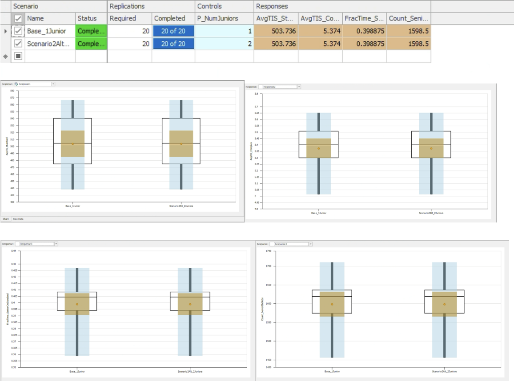
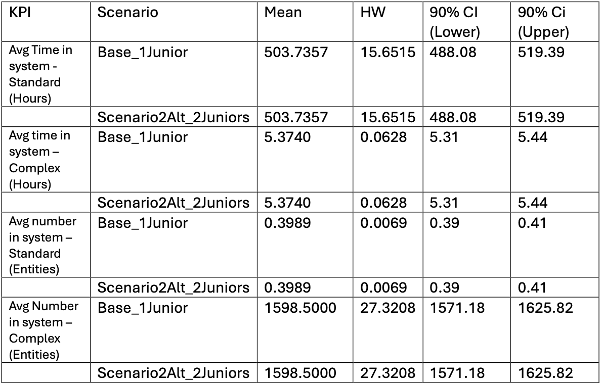
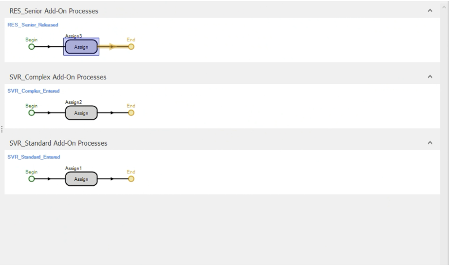
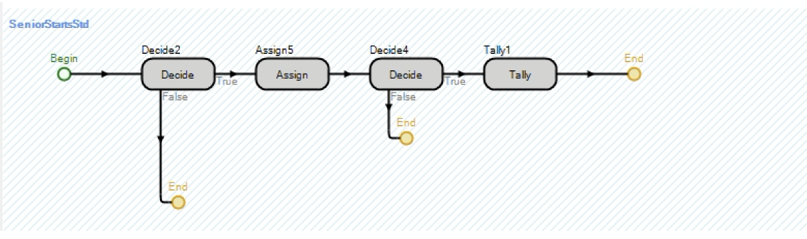
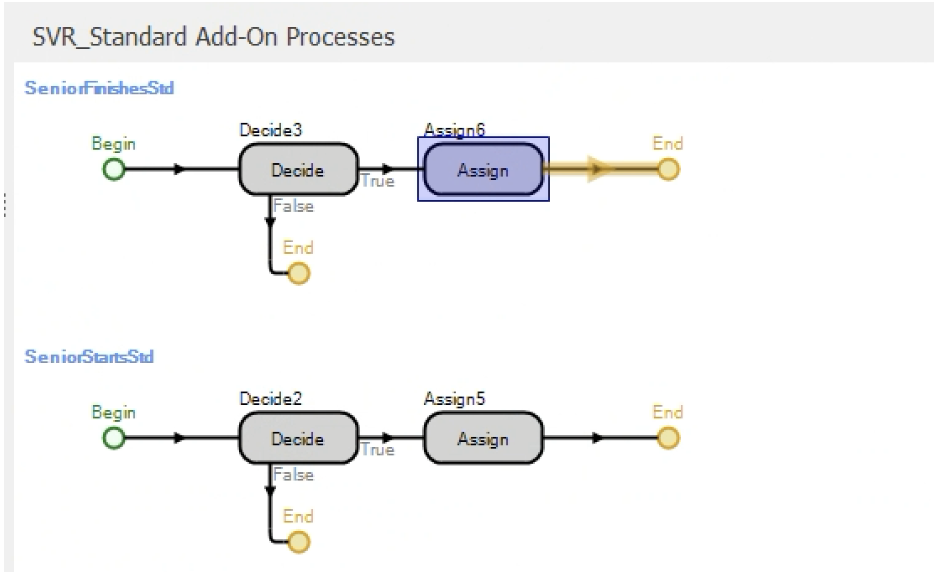

# Tech Repair Center: Workforce Simulation & Hiring Decision
**Discrete-Event Simulation | Simio | Scenario Analysis | Confidence Intervals**

---

## Executive Summary

A university Tech Repair Center was experiencing long wait times across two job types, Standard Maintenance and Complex Repairs, and the manager needed a data-driven recommendation on whether to hire a second Junior Technician. A discrete-event simulation was built in Simio to model the current system and test the impact of an additional hire under identical conditions.

Key finding: **Adding a second Junior Technician produced no measurable improvement across any KPI.** Average time in system for Standard jobs remained at 503.7 hours under both scenarios, with fully overlapping confidence intervals. The root cause is a structurally overloaded queue, where Standard jobs arrive faster than a single junior can process them, making an additional hire insufficient to resolve the bottleneck.

**Recommendation:** Do not hire a second Junior Technician until the underlying queue instability is addressed. The current arrival rate of 1 job/hour against a mean service time of ~1.25 hours per junior creates a utilisation rate above 1, meaning the queue grows indefinitely regardless of headcount. A process redesign or service time reduction should be explored first.

---

## Business Problem

The Tech Repair Center handles two types of jobs: Standard Maintenance (high volume, simpler) and Complex Repairs (low volume, specialist). The current setup has one Junior Technician handling standard jobs and one Senior Technician handling complex repairs, with conditional overflow logic allowing the Senior to assist with standard jobs under specific conditions.

The manager's question was direct:
***Should we hire a second Junior Technician to reduce wait times?***

This simulation was built to answer that question with statistical confidence rather than intuition, comparing KPIs across 20 replications of a 5,000-hour runtime under both staffing scenarios.

**Primary stakeholder:** The Tech Repair Center manager, who needs a clear hire or no hire recommendation backed by simulation evidence.

---

## Methodology

A discrete-event simulation was built in **Simio** to model the full system logic, including conditional resource allocation, custom state tracking, and a two scenario experiment.

**System logic implemented:**
1. Two entity types (Standard Maintenance jobs, Complex Repair jobs) with separate arrival sources and servers
2. The Senior Technician works on Complex Repairs by default, but can assist with Standard jobs only when: no complex jobs are waiting, more than 3 standard jobs are in the queue, and the Senior is not already allocated
3. Custom capacity expression controlling SVR_Standard dynamically based on queue state
4. A Custom State Variable (SeniorOnStandard) tracking whether the Senior is working on a standard job at any point in time
5. A Custom Tally Statistic counting the total number of standard jobs completed by the Senior

**Experiment design:**
- Control: number of Junior Technicians (1 vs 2)
- 4 responses: average time in system for standard jobs, average time in system for complex jobs, fraction of time Senior works on standard jobs, total standard jobs completed by Senior
- 20 replications per scenario, 5,000-hour runtime
- 90% confidence intervals extracted for all KPIs

---

## Skills

**Simio:**
- Discrete-event simulation model building
- Multi-entity, multi-server system design
- Conditional resource allocation using dynamic capacity expressions
- Add-On Process triggers (Before Processing, After Processing, Released)
- Custom State Variables and State Statistics
- Custom Tally Statistics
- Experiment setup with controls and responses
- Scenario comparison with confidence interval visualisation

**Key Simio expressions used:**
- Capacity expression: `1 + ((SVR_Standard.InputBuffer.Contents.NumberWaiting > 3) && (SVR_Complex.InputBuffer.Contents.NumberWaiting == 0) && (RES_Senior.Capacity.Allocated == 0))`
- State tracking: `RES_Senior.Capacity.Allocated > 0`
- Responses: `EntityStandard1.TimeInSystem.Average`, `EntityComplex1.TimeInSystem.Average`, `SeniorOnStandard_Stat.Average`, `SeniorStd_Tally.NumberObservations`

**Statistical Concepts:**
- Confidence interval construction and interpretation
- Scenario comparison using non overlapping CI logic
- Queue stability analysis (utilisation rate)
- Discrete-event simulation design principles

---

## Results & Business Recommendation

### Experiment Results

Both scenarios were run for 5,000 hours across 20 replications each.

*Simio experiment output showing identical mean responses across both scenarios. All four KPIs are unchanged between 1 and 2 Junior Technicians.*

### KPI Summary Table

*90% confidence intervals for all four KPIs across both scenarios. Fully overlapping intervals confirm no statistically meaningful difference between staffing levels.*

### Why Adding a Junior Makes No Difference

The simulation result is not an error, it reflects a real and important finding. Standard jobs arrive at a rate of 1 per hour, but a Junior Technician's mean service time is approximately 1.25 hours (PERT distribution: min 0.5hrs, mode 1hr, max 3hrs). This gives a utilisation rate above 1, meaning the queue grows faster than it can be cleared, regardless of how many juniors are added.

The Senior Technician compensates by handling standard jobs approximately 40% of the time, which partially stabilises the system, but not enough to bring wait times to an acceptable level.

**Recommendation to the manager:** Do not proceed with hiring a second Junior Technician at this stage. The data shows the hire would produce no measurable improvement and cannot be justified by the simulation evidence. Instead, the following should be investigated before any hiring decision is made:

1. **Reduce standard job service times**: Through better tooling, training, or process standardisation, bringing mean service time below 1 hour to achieve a stable utilisation rate
2. **Review the Senior's overflow threshold**: The current rule (queue > 3) may be too conservative, earlier Senior involvement could reduce backlog
3. **Re-run the simulation**: After implementing process changes to determine whether a second hire then produces a statistically significant improvement

---

## Model Logic Screenshots

*Three add-on process triggers used to dynamically update SVR_Standard capacity based on queue state and Senior availability.*

*SeniorStartsStd process logic. A decide step checks whether the Senior is allocated, then assigns the state variable and increments the tally statistic.*

*Before and after processing triggers on SVR_Standard that track when the Senior begins and finishes a standard job.*

---

## Next Steps & Limitations

**Limitations:**
- The simulation uses hypothetical parameters. Real world validation would require actual job arrival and service time data from the center
- The model assumes the Senior always follows the overflow rule as programmed, in practice human judgement may differ
- Warm-up period was not explicitly modelled, which may affect steady-state accuracy

**If I had more time:**
- Add a warm up period analysis to ensure results reflect steady state behaviour rather than startup conditions
- Test additional scenarios such as reducing mean service time or lowering the Senior's overflow threshold
- Add a cost model to the experiment, comparing the cost of hiring against the value of reduced wait times to produce a break-even analysis for the manager

---

*Analysis completed as part of BUSAN 305: Simulation Modelling, University of Auckland, Semester 2 2025.*
